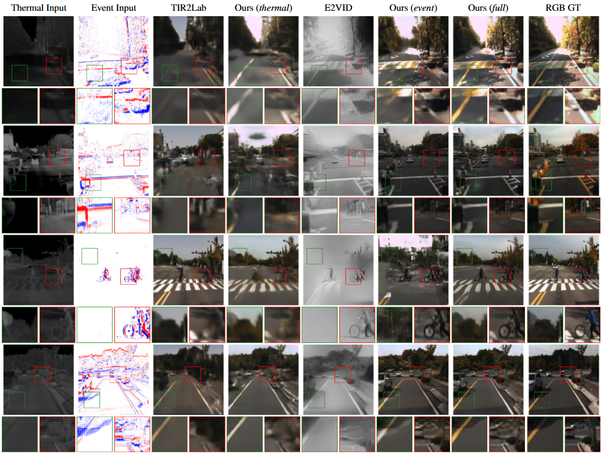

# Fusing Thermal and Event Data for Visible Spectrum Image Reconstruction

[](https://visapp.scitevents.org/)
[](LICENSE)
[](https://pytorch.org/)

---

<p align="center">
  
</p>

**Authors:** Simone Melcarne and Jean-Luc Dugelay
Eurecom Research Center, Digital Security Department, Biot, France

## Publication

This paper has been accepted for publication at the **21st International Conference on Computer Vision Theory and Applications (VISAPP 2026)**.

---

## The Framework

<p align="center">
  
</p>

Our method leverages the complementary nature of two modalities to reconstruct a standard RGB-like image ($I \in \mathbb{R}^{3 \times H \times W}$):

1. **Thermal Input ($T$):** Provides semantic layout and object presence (processed by a ResNet-style encoder).
2. **Event Input ($E$):** A voxel grid of events that offers sharp edge and motion cues (processed by a 3D-Conv head + ResNet encoder).

### Key Components

* **Dual-Fusion Module:** Features from both encoders are fused at multiple resolutions using a **Gated Fusion Block (GFB)**. This allows the network to selectively inject event details into the thermal baseline:

$$f_{TE}^{(i)} = f_T^{(i)} + \alpha_i \cdot f_E^{(i)}$$

* **Color Space:** The network predicts in the **Lab color space** to better separate luminance and chrominance.
* **Loss Function:** Training is end-to-end using a combination of Spatial L1 ($L_{s-l_1}$), Multi-Scale SSIM ($L_{MS-SSIM}$), and Color L1 ($L_{ab-l_1}$) losses.

---

## Dataset Preparation

To reproduce our results, set up the dataset following the structure below. The framework relies on the **KAIST Multispectral Benchmark** (Thermal/RGB) and pre-processed **Event Voxel Grids** simulated via V2E.

### 1. Download Data

1. **KAIST-MS Dataset (Thermal & RGB):**
   Download from the official repository: [https://github.com/SoonminHwang/rgbt-ped-detection](https://github.com/SoonminHwang/rgbt-ped-detection)
   Required folders: `lwir` (Thermal) and `visible` (RGB) for the day sets (`set01`, `set02`, `set06`, `set07`, `set08`).

2. **Event Data (Voxel Grids):**
   Download the pre-processed voxel grids (`.npy` files):
   **[INSERT LINK TO YOUR VOXEL DATA HERE]**
   Generated using the V2E simulator: [https://github.com/SensorsINI/v2e](https://github.com/SensorsINI/v2e)

### 2. Folder Structure

```text
/path/to/your/data/
│
├── kaist-rgbt/                # Original KAIST Dataset
│   ├── set01/
│   │   ├── V000/
│   │   │   ├── lwir/          # I00000.jpg, ...
│   │   │   └── visible/       # I00000.jpg, ...
│   │   └── ...
│   ├── set02/
│   └── ...
│
└── voxel_grid_soft_rgb/       # Pre-processed Event Data
    ├── set01/
    │   ├── V000/
    │   │   ├── set01_V000_00000.npy
    │   │   └── ...
    │   └── ...
    ├── set02/
    └── ...
```

---

## Installation

1. **Clone the repository**

```bash
git clone https://github.com/simonemelc/From-Thermal-and-Event-to-RGB---VISAPP2026.git
cd From-Thermal-and-Event-to-RGB---VISAPP2026
```

2. **Create and activate the environment**

```bash
conda create -n thermal-event-fusion python=3.9 -y
conda activate thermal-event-fusion
```

3. **Install dependencies**

```bash
pip install -r requirements.txt
```

4. **Download pre-trained model**
    Download from [https://github.com/SoonminHwang/rgbt-ped-detection](https://github.com/SoonminHwang/rgbt-ped-detection) ancd place it in:

```bash
└── checkpoints/
    └── best_model.pth
```
---

## Usage

### Training

```bash
python train.py \
  --mode full \
  --encoder_type 3d \
  --fusion gated \
  --smooth_l1 --ms_ssim --ab_loss \
  --batch_size 16 \
  --thermal_dir ./data/kaist-rgbt \
  --rgb_dir ./data/kaist-rgbt \
  --event_dir ./data/voxel_grid_soft_rgb \
  --split_json utils/video_split_day_global.json
```

### Evaluation

```bash
python test.py \
  --mode full \
  --encoder_type 3d \
  --fusion gated \
  --smooth_l1 --ms_ssim --ab_loss \
  --ckpt_dir checkpoints \
  --save_separate \
  --thermal_dir ./data/kaist-rgbt \
  --rgb_dir ./data/kaist-rgbt \
  --event_dir ./data/voxel_grid_soft_rgb
```

---

## Citation

If you find this work useful, please cite:

```bibtex
@inproceedings{melcarne2026fusing,
  author       = {Melcarne, Simone and Dugelay, Jean-Luc},
  title        = {Fusing Thermal and Event Data for Visible Spectrum Image Reconstruction},
  booktitle    = {Proceedings of the 21st International Conference on Computer Vision Theory and Applications - Volume 1},
  year         = {2026},
  pages        = {1282--1290},
  publisher    = {SciTePress},
  organization = {INSTICC},
  isbn         = {978-989-758-804-4},
  issn         = {2184-4321}
}
```
